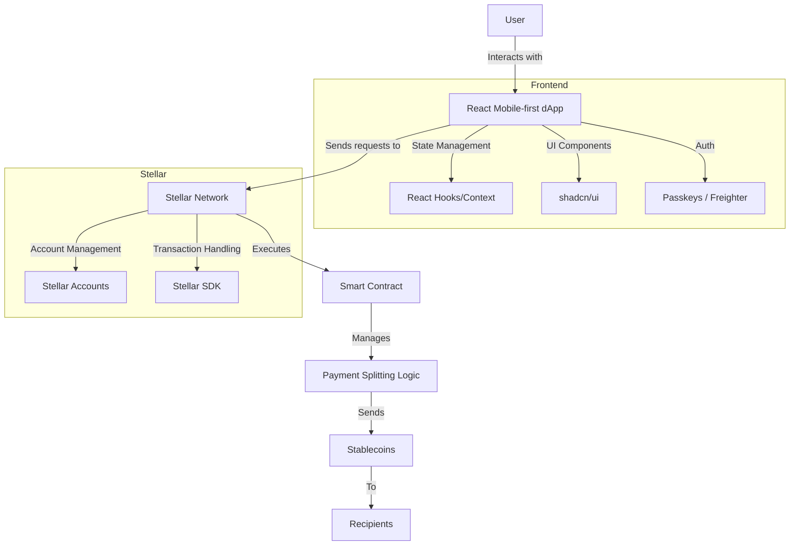

## Payment Splitter

 
    
 

<strong style="font-size: 24px;">Group Splitting Payment App.</strong>

    
        
        
        
    

Make group payments faster, and effortless, and delay worries about extending funds with just a few clicks. 

The Payment Splitter dApp is designed to simplify group payments and make sharing costs as easy as possible for anyone, whether splitting a bill, organizing a group gift, or settling expenses after a trip. With a sleek mobile-first design, the app allows users to interact intuitively and ensures that everyone can quickly settle up.

The app offers multiple features for better usability, including user-friendly payment splitting, expense management, and automatic cost calculations.

### Links

- Live Demo
- Pitch Deck
- Video

### Problem

While blockchain technology is becoming increasingly popular in the finance sector and among software engineers, there remains a significant divide between everyday users and those more experienced with cryptocurrencies. The payment splitting app aims to bridge this gap by offering a simple, intuitive tool that can be adopted by a mainstream audience.

One key challenge faced by users in big groups or those in a rush is the time and effort required to manually calculate and track individual expenses. This app solves that problem by offering fast and efficient payment splitting without needing detailed input from each participant. Users can quickly divide costs, even for large groups, without the hassle of collecting too much information.

The app’s streamlined process allows users to split expenses and execute payments on the go, making it perfect for situations where time is of the essence, like dining with friends, travelling, or group activities. By leveraging blockchain technology and automation, the app ensures smooth, secure transactions while minimizing the complexity for everyday users.

### Solution

### Demo Video

)

### Canva Presentation Slides

https://www.canva.com/design/DAGTabHuIc4/BDLopYPbazWElCHx-Q-Z7A/edit?utm_content=DAGTabHuIc4&utm_campaign=designshare&utm_medium=link2&utm_source=sharebutton

## Features

- Payment Splitting (By Full, By Item, Evenly)
- Lending and Borrowing Opportunity
- Creating groups
- Receipt OCR system
- Simple and intuitive UI thanks to Passkeys integration
  
## Tech Stack

- **Dapp** - React + Vite + shadcn/ui
- **Web3** - Stellar + Soroban smart contracts
- **Auth** - Passkeys / Freigther

### Getting Started

- Install dependenciex - `pnpm i`
- Build smart Soroban smart contracts and deploy to chosen network(optional)
- Copy content of `.env.example` to `.env` and fill it out with your variables
- Start dapp with command `pnpm run dev`
