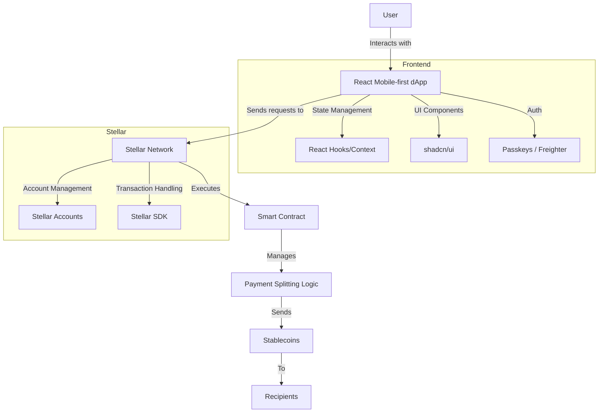

## Payment Splitter

### Links

### Problem

### Solution

### Impact

## Features

-

## Tech Stack

- **Dapp** - React + Vite + shadcn/ui
- **Web3** - Stellar + Soroban smart contracts
- **Auth** - Passkeys

### Getting Started

- Install dependenciex - `pnpm i`
- Build smart Soroban smart contracts and deploy to chosen network(optional)
- Copy content of `.env.example` to `.env` and fill it out with your variables
- Start dapp with command `pnpm run dev`
