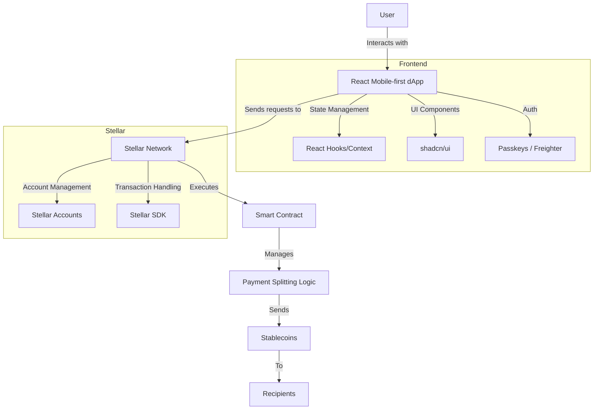

## Payment Splitter

Make group payments faster, and effortless, and delay worries about extending funds with just a few clicks. The Payment Splitter dApp is designed to simplify group payments and make sharing costs as easy as possible for anyone, whether splitting a bill, organizing a group gift, or settling expenses after a trip. With a sleek mobile-first design, the app allows users to interact intuitively and ensures that everyone can quickly settle up.

The app offers multiple features for better usability, including user-friendly payment splitting, expense management, and automatic cost calculations.

### Links

Here is a list of helpful resources for those interested in expanding or contributing to the project:

- https://developers.stellar.org/: This is the official documentation for the Stellar framework, offering a comprehensive guide on how to build decentralized applications (dApps) using Stellar. It includes step-by-step instructions on writing and deploying smart contracts, integrating with the Stellar network, and implementing frontend solutions that interact with Stellar-based services.
- https://okashi.dev/: A resource specifically tailored for isolated development of Soroban smart contracts, providing examples, tools, and guides that help developers focus on building and testing their Soroban contracts in controlled environments. This is an excellent starting point for those new to blockchain smart contract development.
- https://github.com/kalepail/soroban-passkey?tab=readme-ov-file: This repository contains the original implementation of Soroban passkey integration, which enables secure and decentralized authentication via WebAuthn/FIDO2. It serves as a reference for how passkeys can be used to provide a password-less authentication flow within blockchain applications.
- https://doc.rust-lang.org/beta/book/foreword.html: This is the official Rust documentation, providing a detailed overview of the Rust programming language. It covers key syntax and concepts essential for building secure and efficient smart contracts with Soroban on Stellar. The Rust book is especially useful for those who are new to the language but want to leverage its capabilities for blockchain development.

### Problem

While blockchain technology is becoming increasingly popular in the finance sector and among software engineers, there remains a significant divide between everyday users and those more experienced with cryptocurrencies. The payment splitting app aims to bridge this gap by offering a simple, intuitive tool that can be adopted by a mainstream audience.

One key challenge faced by users in big groups or those in a rush is the time and effort required to manually calculate and track individual expenses. This app solves that problem by offering fast and efficient payment splitting without needing detailed input from each participant. Users can quickly divide costs, even for large groups, without the hassle of collecting too much information.

The app’s streamlined process allows users to split expenses and execute payments on the go, making it perfect for situations where time is of the essence, like dining with friends, travelling, or group activities. By leveraging blockchain technology and automation, the app ensures smooth, secure transactions while minimizing the complexity for everyday users.

### Solution

-
-
-

### Impact

## Features

- Payment Splitting (By Full, By Item, Evenly)
- Lending and Borrowing Opportunity
- Creating groups
- Receipt OCR system
- Simple and intuitive UI
- Wide audience
  
## Tech Stack

- **Dapp** - React + Vite + shadcn/ui
- **Web3** - Stellar + Soroban smart contracts
- **Auth** - Passkeys

### Getting Started

- Install dependenciex - `pnpm i`
- Build smart Soroban smart contracts and deploy to chosen network(optional)
- Copy content of `.env.example` to `.env` and fill it out with your variables
- Start dapp with command `pnpm run dev`
